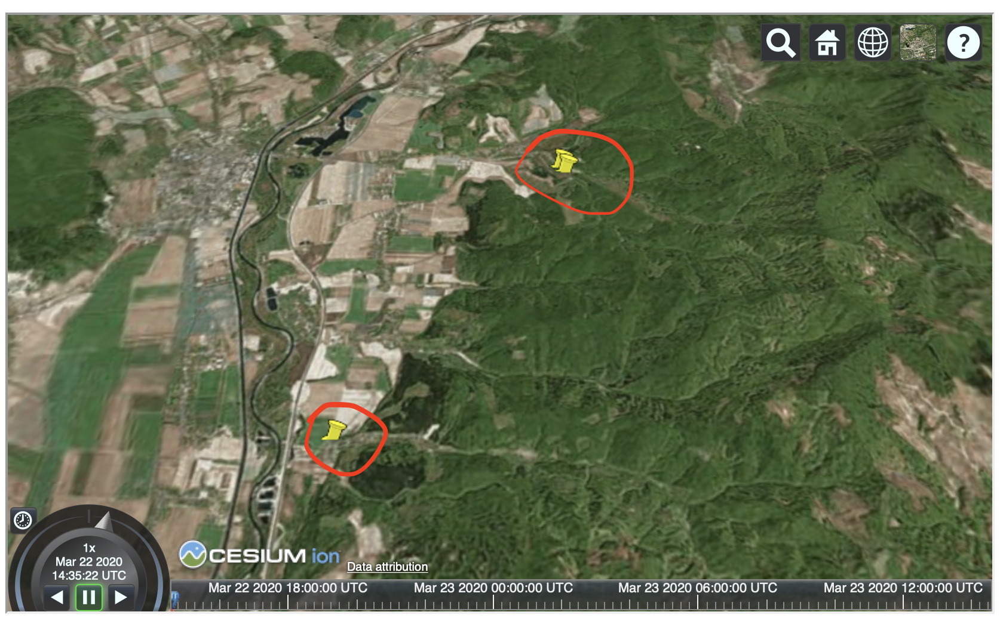

# Work Log

## 6.10.2021

Reinkarnácia nápadu a mapovania BMX a pumptrack tratí.

Nakreslis som aspon Dlhú.
<https://www.openstreetmap.org/relation/13298109#map=19/48.41909/17.41549>

## 5.2.2020

- Preco je v bezkarskom FIT zazname kadencia ?
- cool plugin GPX segment tool
- to iste som ale vcera kodol v mojich UI gps tools (hrozne) 
  a zda sa ze to sedi +- na centimetre

- https://docs.sigro.org/qgis-basic-training/en/analyses.html

## 26.1.2020

sniffs z https://mapy.bratislava.sk/
a nasledne zostavenie fake GetCapabilities v docs/spikes/mapy.bratislava.sk/capabilities.xml

takto sa daju aj dalsie vrstvy, abo to QGis WMS klient zvladol
	
## 25.1.2020

https://grassbook.org/wp-content/uploads/neteler/como2006/grass_como2006_v3.pdf

## 15.1.2020 OSM and CLI

!!!!

	is_in API hlada len v takych ways ktore maju meno
	takze nenajde nepomenovanu landuse

	lebo: https://github.com/drolbr/Overpass-API/blob/master/src/rules/areas.osm3s

!!!!

nastal cas na nejaku automatizaciu manualnych klikaciek v QUick OSM
a neustalych manualnych refreshov layerov (v QGise) po opravach v JOSM

	https://wiki.openstreetmap.org/wiki/Overpass_API/Language_Guide

	https://overpass-api.de/query_form.html

	https://overpass-api.de/api/interpreter

	https://wiki.openstreetmap.org/wiki/Overpass_API/Overpass_API_by_Example#Adding_Georeference_details_to_village_nodes_.28since_0.7.54.29

## 13.2.2020 symbols

https://github.com/nationalparkservice/symbol-library/

https://github.com/AmericanRedCross
https://www.spatialised.net/painting-terrain-in-qgis/

## 12.2.2020

merging DMR3.5 a DMR5
stale je s tym problem QGis 3.17 na OSX nevie
gdal aj 3.10 stale spravi z DMR%ky DMR3.5 rozlisenie

nasiel som hint na align rasters ten spravi resampling 3.5 na 5 resolution a potom snad mozeme mergovat

podozrive CRS v fifoch od freemap/~martin

lazisko nazvoslovie http://www.moravcik.alconet.sk/sk/lazisko

## 11.1.2020 Hillshades and overlays

https://www.esri.com/arcgis-blog/products/product/imagery/an-alternative-to-overlaying-layer-tints-on-hillshades/
https://wanderingcartographer.wordpress.com/tag/shaded-relief/

## 10.1.2020

More styles research:

<https://plugins.qgis.org/styles/>
<https://gis.stackexchange.com/questions/165574/qgis-how-to-label-individual-sides-of-polygon>
<https://anitagraser.com/2017/04/08/a-guide-to-geometry-generator-symbol-layers/>

<https://www.gislounge.com/series-webgis-using-open-source-tools/>
https://gis.stackexchange.com/questions/255733/importing-moving-rotating-and-scaling-jpg-images-onto-osm-maps-in-qgis

TODO: QGis modeler

### Merging ZBGIS DMS data

	gdal_merge.py -o ../gis-projects/qgis/dmr-merged/merge1.tif  \
		$(xs-find ../gis-projects/data/zbgis/DMR5-KU/*/dmr/ -name "hdr.adf")

## 9.1.2021

QGis Map showcase <https://www.flickr.com/groups/qgis/>

some gdal python scripts in QGis (merge, rasterize) still not working, trying to resolve.

    # uninstall gdal
	brew uninstall gdal
	
	brew install gdal
	pip3 install gdal

<https://medium.com/@egiron/how-to-install-gdal-and-qgis-on-macos-catalina-ca690dca4f91>

Seems standalone GDAL now rorks atd least

For q gis I give up and go for kyngchaos install.
https://www.kyngchaos.com/files/software/qgis/QGIS-macOS-3.16.2-2.dmg

Fails to load as well, back to nightly version:

Symbol not found: _curl_mime_addpart
Referenced from: /Applications/QGIS.app/Contents/MacOS/bin/../lib/libgdal.27.dylib
Expected in: /usr/lib/libcurl.4.dylib

Nakonieco som instalol 3.10 a tam merge layers ide

### Generovanie tiles:

<https://wiki.openstreetmap.org/wiki/Slippy_map_tilenames#Resolution_and_Scale>

## 4.1.2021
	
Zoznam unique kategorii:

	$ ogrinfo /Users/marcus/workspaces/map-projects/_private/data/zbgis_gn_shp/geograficky_nazov.shp -dialect sqlite -sql "select distinct CAT from geograficky_nazov" | grep "=" | cut -d= -f2 | trim
	
	Pole
	Les
	Vrch
	Majer, osada, samota, miestna čas
	Kanál, náhon
	Vinica
	Dolina
	Vodný tok
	Rybník, rybníky
	Lúka, pasienok
	Cesta
	Vodná nádrž

County objektov za jednotlive "kategorie":
	
	ogrinfo /Users/marcus/workspaces/map-projects/_private/data/zbgis_gn_shp/geograficky_nazov.shp -dialect sqlite -sql "select cat,count(*) from geograficky_nazov group by CAT" | grep "=" | cut -d= -f2 | trim | paste - -

	ogrinfo /Users/marcus/workspaces/map-projects/_private/data/INSPIRE/INSPIRE_GN.gpkg -dialect sqlite -sql "select localType,count(*) from geograficky_nazov group by localCount" | grep "=" | cut -d= -f2 | trim | paste - -

Dva vodopadny na ZBGIS

https://zbgis.skgeodesy.sk/mkzbgis/sk/zakladna-mapa?bm=orto&z=19&c=20.220761,49.167466&it=point&sc=n#/detail/zbgis/98/57395
https://zbgis.skgeodesy.sk/mkzbgis/sk/zakladna-mapa?bm=orto&z=19&c=20.220761,49.167466&it=point&sc=n#/detail/zbgis/98/58907	

Luciansky vodopad:

https://zbgis.skgeodesy.sk/mkzbgis/?bm=zbgis&z=18&c=19.402165,49.129813#/detail/zbgis/79/615974

## 3.2.2021 Mapovanie Lipt. Jan

Pokus rozchodit DMR z minulych cias
https://zbgis.skgeodesy.sk/zbgis/rest/services/DMR/MapServer/tile/16/22659/36097?blankTile=false

zatial neuspesne...

## 1.1.2021

2021-01-01T20:50:28     WARNING    bu-core2d:Building: The download limit has been reached. You may want to check the 'Only request features overlapping the view extent' option to be able to zoom in to fetch all data.

## 30.12.2020

<https://inspirujmese.cz/wp-content/uploads/2019/10/05_InspirujmeSe_KD_2019.pdf>

Styling: 

http://qgis-hub.fast-page.org/index.php
https://plugins.qgis.org/planet/tag/style/

Na mojom MacBook pro som nevyriesil, na masine doma chodi:

/Garmin-FIT /Library/Perl/5.18/darwin-thread-multi-2level /Library/Perl/5.18 /Network/Library/Perl/5.18/darwin-thread-multi-2level /Network/Library/Perl/5.18 /Library/Perl/Updates/5.18.4 /System/Library/Perl/5.18/darwin-thread-multi-2level /System/Library/Perl/5.18 /System/Library/Perl/Extras/5.18/darwin-thread-multi-2level /System/Library/Perl/Extras/5.18 .) at tools/Garmin-FIT/fit2gpx.pl line 9.
BEGIN failed--compilation aborted at tools/Garmin-FIT/fit2gpx.pl line 9.

### JOSM 
uspesne som zvladol niekolko updatov

## 28.12.2020

- TODO: metasearch plugin
- <https://www.sora.sk/digitalne-mapy-pozemkov-geoinformatika-v-katastri>

- show feature count (otravne) https://github.com/qgis/QGIS/issues/27128

- Architektura ZBGIS http://www.skgeodesy.sk/files/slovensky/ugkk/cerpanie-prostriedkov-z-eu/programove-obdobie-2007-2013/michalik_geoportal-sluzby-zbgis.pdf

- OSM Styles for QGis 
https://gis.stackexchange.com/questions/90086/seeking-qml-or-sld-file-for-qgis-openstreetmap-data

- https://wiki.openstreetmap.org/wiki/Sk:WikiProjekt_Slovensko
- https://github.com/yannos/Beautiful_OSM_in_QGIS
- https://wiki.openstreetmap.org/wiki/QGIS#Styles_for_OSM_data_in_QGIS 

Protected areas: dalsi zdroj informacii
<https://www.minzp.sk/files/rpi/dokumenty-stiahnutie/dfs-metaudajovy-profil.pdf>
<https://www.arcgis.com/home/item.html?id=97dda2016a614546aecb28709102e345>

Problem: wms service vracia na niektorych datach:

	Download of features for layer dendrodoc:geo_zameranie failed or partially failed: Server generated an exception in GetFeature response: org.opengis.referencing.NoSuchAuthorityCodeException: No authority was defined for code "". Did you forget "AUTHORITY:NUMBER"?
	             No authority was defined for code "". Did you forget "AUTHORITY:NUMBER"?. You may attempt reloading the layer with F5

<https://gis.stackexchange.com/questions/368707/qgis-problem-loading-or-adding-wfs-layer>

WMS requests:

http://localhost:8083/geoserver/wfs?request=GetFeature&service=WFS&version=1.0.0&typeName=geosolutions:WorldCountries&outputFormat=application/json&CQL_FILTER=NAME=%27Monaco%27

## 26.12.2020

PIA na zaklade vzdialenosti od osidlenych oblasti

1. Co je to osidlena oblast ?
2. Ako ziskat mapove podklady pre osidelene oblasti ?
3. Ako spocitat PIA ?

2. Ako ziskat mapove podklady pre osidelene oblasti

- nakoniec donwload: z Corine CLC
  - https://land.copernicus.eu/pan-european/corine-land-cover/clc2018?tab=download
  - https://land.copernicus.eu/user-corner/technical-library/corine-land-cover-nomenclature-guidelines/html/index.html
  
Ostatne zaujimave linky:

- http://geoportal.gov.sk/sk/map?wmc=http%3A%2F%2Fgeoportal.gov.sk%2Fwmc%2F4ebe874b-e2af-48cd-9dbb-501756b21302.xml
  - https://sdi.eea.europa.eu/catalogue/copernicus/eng/csw?SERVICE=CSW&VERSION=2.0.2&REQUEST=GetCapabilities

- ArcGis, World Populated Places <https://www.arcgis.com/home/item.html?id=587c838521864164acd245ea03315006>, nepouzitelne zo slovenska je tam 6 miest, navyse su to points, nie polygons

- Land Cover analyzy https://fromgistors.blogspot.com/2018/02/basic-tutorial-1.html

Problem:

No module named '_gdal' pri polygonize , <https://github.com/qgis/QGIS/issues/40764>
Podobne issues a riesenim je pridat PYTHONPATH v Qgis settingoch https://github.com/qgis/QGIS/issues/33386
ale teraz koncim na 

dlopen(/Applications/QGIS.app/Contents/Resources/python/site-packages/GDAL-3.1.2-py3.7-macosx-10.13.0-x86_64.egg/osgeo/_gdal.cpython-37m-darwin.so, 2): Symbol not found: _curl_mime_addpart

gdal_polygonize.py /Users/marcus/workspaces/map-projects/docs/pole-of-inaccessibility/pia-sidla/clc-sk.tif /private/var/folders/cs/7zzbk12j0k14ykd00r62l3jc0000gn/T/processing_hguMBy/1a7609a913e541f79eda79ed8b7c7473/OUTPUT.gpkg -b 1 -f "GPKG" OUTPUT DN

vzdal som to: a installing nightly release
<https://qgis.org/en/site/forusers/alldownloads.html#qgis-nightly-release>

a tuna je kongig kde ostanu zapametane nastavenia z predoslej instalcie:
~/Library/Application\ Support/QGIS/QGIS3/profiles/default/

QGIS nightly release
A nightly updated standalone installer from QGIS master can be downloaded from here.

Installing python 3.6 on OSX , another pain:

brew install does not work
trying to use  
brew install pyenv a potom 
pyenv install 3.6.12

## 24.12.2020 Point Nemo

- <https://inaccessibility.net/calculating-poles-of-inaccessibility/>
- <https://github.com/mapbox/polylabel>
- <https://plugins.qgis.org/plugins/SelectWithin/>
- <https://docs.qgis.org/testing/en/docs/user_manual/processing_algs/qgis/vectorgeometry.html#pole-of-inaccessibility>

Calculate pint-of-inaccessibility for lakes 

TODO review <https://www.gpxsee.org/>
TODO review <https://apizone.suunto.com/faq>

## 6.11.2020

https://wiki.openstreetmap.org/wiki/Key:surface

Calculating OSM Surface

  if(surface!='',
    surface,
    if(highway in ('primary','secondary','tertiary'),
    'asphalt',
    'UNKNOWN'
    )
  )

## 2.11.2020

Z trailforms sa oplati downloadovat veci ako *.osm, lebo obsahuju aj dalsie atributy, okrem ineho napriklad aj mtb:scale:imba:

	"name"=>"Baník trail","highway"=>"path",
	"bicycle"=>"designated",
	"surface"=>"dirt",
	"source:name"=>"Trailforks.com",
	"website"=>"https://www.trailforks.com/trails/banik-trail/",
	"mtb:type"=>"AM",
	"mtb:scale:imba"=>"2",
	"tf:id"=>"258802",
	"tf:difficulty"=>"4",
	"tf:rid"=>"23484"
	
ale vsecko je zgrznute do jedneho fieldy other_tags
tu je nejaka diskusia ako to rozbit <http://osgeo-org.1560.x6.nabble.com/gdal-dev-splitting-other-tags-from-osm-file-td5293451.html>
	

## 30.10.2020

- fixing some bugs in gps2gpkg

7.3 Lesson: Network Analysis

## 29.10.2020

- continue collecting bike track in karpaty from OSM
- finding more object to include in query (see OSM.md)
- fixing some data on OSM (operators of TBK trails

<http://www.undertheraedar.com/2015/10/glowing-lines-in-qgis.html>
<https://gis.stackexchange.com/questions/360416/calculating-overlap-of-several-lines-in-qgis>
<https://gis.stackexchange.com/questions/246510/adding-offset-to-overlapping-lines-in-qgis-in-same-layer>

<https://gis.stackexchange.com/questions/330383/counting-number-of-features-within-another-feature-using-aggregating-function-in>

<https://docs.qgis.org/testing/en/docs/user_manual/working_with_vector/expression.html>

	/*
	Labels each region with its highest (in altitude) airport(s)
	and altitude, eg 'AMBLER : 264m' for the 'Northwest Artic' region
	*/
	with_variable(
	  'airport_alti', -- stores the highest altitude of the region
	  aggregate(
	    'airports',
	    'max',
	    "ELEV", -- the field containing the altitude
	    -- and limit the airports to the region they are within
	    filter := within( $geometry, geometry( @parent ) )
	  ),
	    aggregate( -- finds airports at the same altitude in the region
	      'airports',
	      'concatenate',
	      "NAME",
	      filter := within( $geometry, geometry( @parent ) )
	        and "ELEV" = @airport_alti
	    )
	    || ' : ' || @airport_alti || 'm'
	    -- using || allows regions without airports to be skipped
	)

Join Attributes by location (summary) dokaze spocitat s kolkymi inymi feature sa dana feature krizuje, alebo v nasom pripade prekryva. v stlpci fid_count je ten pocet

teraz je otazka ako spocitat z tohto offset, kedze aj tie ostatne budu mat rovnaky pocet.

Aj tak je to na nic lebo to pocita kolko ma overlays z inymi trasami, ale nie v konkretnom mieste, naprikla Sakra Velo je 33 overlayov ale na konkretnom mieste sa prekryva len z jednou alebo dvoma trasami. takze je treba to splitnut na jednotlive useky.

Takze najskorej "Split with lines". Toto je tiez uchylka lebo ways ktore su v relations s danou trasou uz su takto nasplitovane. toto bezi len nad karpatmi minuty.

Lenze Split with lines sprav 2000 lines zo 6tich, nie 12 ako je ocakavane.
zeby nieco tuna ? <https://github.com/qgis/QGIS/issues/14070>

	# higher_overlays, calculated value 
	with_variable('cfid',fid,
	aggregate('02-joined','count_distinct',fid_2,fid=@cfid and fid<fid_2)
	)

## 28.10.2020
Misia ako konvertnut vsecky gpx z disku do jedneho GeoPackage ?

Basic: 
	
	ogr2ogr -f GPKG output.gpkg  "data/myTracks/2020-03-26 15_35_35-horaren-pekna-cesta.gpx"

Update:
	
	ogr2ogr -update -append -f GPKG output.gpkg  "data/others/roland/cerova-activity_4812673330-stops.gpx"
	
Ale tu je problem ze sa vsecky tracky daju do layery tracks a vsetky wpt do waypoints
a strati sa vezba medzi waypoints a trackom. ako to dokazat premenovat ?

	

## 27.10.2020
Training materials chapetr 1..7

## 26.10.2020

Experimenting with gpx to QGis mapping, how are tracks, tracksequences etc mapped to qgis geometry ?

What are the geometries (Line, Multiline) in GIS ? <http://help.arcgis.com/en/geodatabase/10.0/sdk/arcsde/concepts/geometry/shapes/types.htm>

Time to RTFM ?: <https://docs.qgis.org/2.18/en/docs/gentle_gis_introduction/vector_data.html>
, <https://docs.qgis.org/3.4/pdf/en/QGIS-3.4-QGISTrainingManual-en.pdf>

Studium Traing materialov a export protected areas z OSM do KML a excelu, na zaklade toho som aspon opravil údaje na OSM https://www.openstreetmap.org/way/309991398

### Problematika mapy stupnov ochrany prirody
<https://www.facebook.com/groups/1719589758277564/permalink/2778409132395616/>

podobnu vec riesili na hiking.sk <https://hiking.sk/hk/fo/58088/klm_subory_slovenskych_np_a_chko.html?offset=0&period=&fifo=>
a tuna je nieco <http://wiki.freemap.sk/LayerSopsr> a aj tuna <https://groups.google.com/g/osm_sk/c/J0ItJw1lKDE>

nasiel som zdoje dat:

<http://maps.sopsr.sk/geoserver/ows> (tento ma zle malu fatru)
a
<https://app.sazp.sk/atlassr/proxy.ashx?https://arc.sazp.sk/arcgis/rest/services/atlassr/atlassr_08/MapServer/export?bbox=-595107.082520365%2C-1451785.892234829%2C93602.58132958648%2C-1119363.112236737&bboxSR=102067&imageSR=102067&size=3290%2C1588&dpi=192&format=png32&transparent=true&layers=show%3A218%2C220%2C221&f=image>

Exporting KML with colors: <https://gis.stackexchange.com/questions/151188/is-there-a-way-to-export-the-style-along-with-a-shapefile-to-a-kml-in-qgis>

### Some GPX queries
To find samples for experiments you may need to find:

GPX files with more then one track segment:

	git grep -c "<trkseg>" *.gpx | grep -v ":1$"

GPX files without elevation:

	git grep -L "<ele>" *.gpx

GPX files with waypoints:

	git grep -l "<wpt " *.gpx
		
GPX files with route
	
	git grep -l "<rte>" *.gpx
	
GPX files withou name (any)

	git grep -L "<name>" *.gpx	

## 25.10.2020 How to in Qgis

- mark start and end of gpx track
	- <https://gis.stackexchange.com/questions/272534/adding-symbols-to-the-end-of-a-line>
- get OSM as layers (not as base map) to QGis 
	- QuickOSM plugin and query by canvas extend 	 

## 25.10.2020 How to publish and eBook

<https://www.freecodecamp.org/news/taking-off-the-successful-launch-of-an-open-source-book-7553a2262898/>

## 25.10.2020 QGis on OSX

QGis 3.14 for Windows is very different from QGis 3.14 for OSX. OSX version is far beyond, using 2 years old proj lib and other older stuff.

Installing nightly <https://qgis.org/en/site/forusers/alldownloads.html?highlight=nightly#qgis-nightly-release> OSX build may help.

qProf plugin seems no fail on startup ;-)

## 23.10.2020 OSM a historia zaznamov

Kto babral z poziciou Malej Bane na OSM ?

  https://www.openstreetmap.org/node/333130989/history

CLI: 
	
	curl https://www.openstreetmap.org/api/0.6/node/333130989/history | xmlstarlet sel -T -t -m 'osm/node' -v 'concat(@lon, ",", @lat,",",@user)' -n | awk-uniq

Example output:

	17.1296718,48.2181798,2009-01-18T17:10:11Z,NiCK_n17
	17.1296718,48.2181798,2009-02-01T18:40:41Z,ulfl
	17.1296718,48.2181798,2012-02-24T17:41:52Z,mareko
	17.1296718,48.2181798,2012-12-28T16:02:15Z,mareko
	17.1296559,48.2181889,2015-09-06T12:36:53Z,FishDoctor
	17.1296559,48.2181889,2015-12-04T08:54:36Z,RomanKucera
	17.1296559,48.2181889,2015-12-04T08:57:51Z,RomanKucera
	17.1296559,48.2181889,2015-12-04T08:59:33Z,RomanKucera
	17.1299474,48.2181438,2017-01-23T09:19:15Z,Ivor Švihran
	17.1299474,48.2181438,2017-05-17T21:22:00Z,rmikke
	17.1299474,48.2181438,2019-03-29T20:24:54Z,b-jazz-bot

## 22.10.2020 batch konverzia *.fit na *.gpx aj z nejakym premenovanim suborov
  
  tools/fitconvert.sh ../gis-projects/data/suunto/fit/*.fit
  
Zareportovany bug na altitude, Garmin-FIT (perl project):

  https://github.com/mrihtar/Garmin-FIT/issues/29

## back after 5 months 19.10.2020

some tests of fit-file-parser js library

  nvm use 13
  cd docs/spikes

  npx mocha ./test/spec.js --grep FIT

## 10.5.2020

data v DMR su v BVP (EPSG:8357), v akych systemoch su data z hodiniek a data z strava a srtm atd... ? 

Transformačná služba podporuje transformáciu výšky súčasne medzi dvoma z nasledujúcich výškových systémov:

Baltský výškový systém po vyrovnaní - realizácia Bpv (1957), označenie Bpv - EPSG:8357
Európsky vertikálny referenčný systém - realizácia EVRF2007, označenie EVRS (EVRF2007_AMST) - EPSG:5621
Elipsoidická výška nad elipsoidom GRS80, označenie ETRS89-h
Použité výškové transformácie:

  Vstupný      výškový systém
  Výstupný      výškový systém
  Transformácia [EPSG kód]
  ETRS89-h	Bpv	 8361
  Bpv	ETRS89-h	 8361
  ETRS89-h	EVRS (EVRF2007_AMST)	 8362
  EVRS (EVRF2007_AMST)	ETRS89-h	 8362
  Bpv	EVRS (EVRF2007_AMST)	 8363
  EVRS (EVRF2007_AMST)	Bpv	 8363

https://www.geoportal.sk/sk/sluzby/aplikacie/transformacna-sluzba/
https://evrs.bkg.bund.de/Subsites/EVRS/EN/EVRF2019/evrf2019.html;jsessionid=D13612238F46370227C833D89751D4CF.live22

## 4.5.2020
Zaver: na 2 kroky crop a resize
na jeden krok to zatial neviem produkuje vyshiftovane 
vysledky
  //(-572050.052789, -1274853.113015) - (-569926.923109, -1272495.610625)
  

  gdal_translate \
    -projwin -572124.3244690781 -1272433.6863660824 -569835.9694763866 -1274876.3701579568 \
    -of GTiff -co COMPRESS=NONE -co BIGTIFF=IF_NEEDED \
    ../gis-projects/data/zbgis/DMR3.5/10m/dmr3_5_10.tif \
    ../gis-projects/qgis/elevation-profiles/okrajovka2/dmr-clip-translate.tif
 
  gdal_translate -tr 1 1 -r bilinear \
    ../gis-projects/qgis/elevation-profiles/okrajovka2/dmr-clip-translate.tif \
    ../gis-projects/qgis/elevation-profiles/okrajovka2/dmr-clip-translate.resize.tif

-----
rescale to 1m per pixel

  gdalwarp -tr 1 1 -r bilinear -co COMPRESS=DEFLATE -co PREDICTOR=2 -co ZLEVEL=9 ../gis-projects/data/zbgis/DMR3.5/10m/dmr3_5_10.tif ../gis-projects/data/zbgis/DMR3.5/10m/dmr3_5_10_resampled_1m.tif

get extent in WGS:

  cat /Volumes/data/_WORK/gis-projects/qgis/elevation-profiles/okrajovka2/suunto.gpx | ogrinfo -so /vsistdin/  track_points | grep Extent:

get extent in CRS_5513_4836

  ogr2ogr -t_srs "$CRS_5513_4836" -f GeoJSON /vsistdout/ /Volumes/data/_WORK/gis-projects/qgis/elevation-profiles/okrajovka2/suunto.gpx track_points | ogrinfo -so /vsistdin/ track_points | grep ^Extent

  Warning 1: The output driver does not natively support DateTime type for field time. Misconversion can happen. -mapFieldType can be used to control field type conversion.
  Extent: (-572050.052789, -1274853.113015) - (-569926.923109, -1272495.610625)

  $ ogr2ogr -t_srs "$CRS_5513_4836" -f GeoJSON /vsistdout/ /Volumes/data/_WORK/gis-projects/qgis/elevation-profiles/okrajovka2/suunto.gpx tracks | ogrinfo -so /vsistdin/ tracks | grep ^Extent
  Extent: (-572050.052789, -1274853.113015) - (-569926.923109, -1272495.610625)

get extent in CRS_5513

  ogr2ogr -t_srs "EPSG:5513" -f GeoJSON /vsistdout/ /Volumes/data/_WORK/gis-projects/qgis/elevation-profiles/okrajovka2/suunto.gpx track_points | ogrinfo -so /vsistdin/ track_points | grep ^Extent
  Extent: (-572046.087116, -1274856.317397) - (-569922.959333, -1272498.841086)

get extent in CRS_102065_4936 
  
  export CRS_102065_4936="+proj=krovak +lat_0=49.5 +lon_0=24.83333333333333 +alpha=30.28813975277778 +k=0.9999 +x_0=0 +y_0=0 +ellps=bessel +towgs84=485.0,169.5,483.8,7.786,4.398,4.103,0.0 +units=m +no_defs"

  ogr2ogr -t_srs "CRS_102065_4936" -f GeoJSON /vsistdout/ /Volumes/data/_WORK/gis-projects/qgis/elevation-profiles/okrajovka2/suunto.gpx track_points | ogrinfo -so /vsistdin/ track_points | grep ^Extent
  

rescale cliped:

  gdalwarp \
    -te -572050.052789 -1274853.113015 -569926.923109, -1272495.610625 \
    -tr 1 1 -r bilinear \
    ../gis-projects/data/zbgis/DMR3.5/10m/dmr3_5_10.tif \
    ../gis-projects/qgis/elevation-profiles/okrajovka2/dmr-clip-1m.tif

add some padding -100m,-100m,+100m,+100m

  gdalwarp \
    -te -572150.052789 -1274954.113015 -569826.923109, -1272395.610625 \
    -tr 1 1 -r bilinear \
    ../gis-projects/data/zbgis/DMR3.5/10m/dmr3_5_10.tif \
    ../gis-projects/qgis/elevation-profiles/okrajovka2/dmr-clip-1m-pad.tif  

# TODO: podla mna tie cisla treba zaokruhlit tak aby sedeli 10m stvorce z povodneho kanvasu !!!!!!
  teda podla extendu z povodneho DMR a pricitavat 10ky metrov

alebo skusit na dva kroky najskorej gdal_translate a potom gdalwarp

  gdal_translate \
    -projwin -572060.6294999484 -1273896.0341993005 -572008.0423813025 -1273931.8169932112 \
    -of GTiff -co COMPRESS=NONE -co BIGTIFF=IF_NEEDED \
    ../gis-projects/data/zbgis/DMR3.5/10m/dmr3_5_10.tif \
    ../gis-projects/qgis/elevation-profiles/okrajovka2/dmr-clip-translate.tif

  gdalwarp \
    -te -572060.6294999484 -1273896.0341993005 -572008.0423813025 -1273931.8169932112 \
    ../gis-projects/data/zbgis/DMR3.5/10m/dmr3_5_10.tif \
    ../gis-projects/qgis/elevation-profiles/okrajovka2/dmr-clip-warp.tif

 tieto dve veci hore produkuju iny vysledok, treba zistit preco.
 Aj tento oneliner na resize a crop je vyshiftovany, zly

   gdal_translate  -tr 1 1 -r bilinear   -projwin -572060.6294999484 -1273896.0341993005 -572008.0423813025 -1273931.8169932112     -of GTiff -co COMPRESS=NONE -co BIGTIFF=IF_NEEDED     ../gis-projects/data/zbgis/DMR3.5/10m/dmr3_5_10.tif     ../gis-projects/qgis/elevation-profiles/okrajovka2/dmr-clip-translate-1m.tif

 ak to spravim na dva kroky je to ok:

  gdal_translate \
    -projwin -572060.6294999484 -1273896.0341993005 -572008.0423813025 -1273931.8169932112 \
    -of GTiff -co COMPRESS=NONE -co BIGTIFF=IF_NEEDED \
    ../gis-projects/data/zbgis/DMR3.5/10m/dmr3_5_10.tif \
    ../gis-projects/qgis/elevation-profiles/okrajovka2/dmr-clip-translate.tif
 
 gdal_translate  -tr 1 1 -r bilinear ../gis-projects/qgis/elevation-profiles/okrajovka2/dmr-clip-translate.tif ../gis-projects/qgis/elevation-profiles/okrajovka2/dmr-clip-translate.resize.tif
  

## Cliping DMR to extent of GPX file

### QGis - clip raster by extent
  
  17.120936019346118,17.148829400539398,48.200605837628245,48.22080119512975 [EPSG:4326]

  gdal_translate -projwin -572123.9637925692 -1272434.3089299337 -569835.6164588864 -1274876.9858656945 -of GTiff -co COMPRESS=NONE -co BIGTIFF=IF_NEEDED /Volumes/data/_WORK/gis-projects/data/zbgis/DMR3.5/10m/dmr3_5_10.tif /Volumes/data/_WORK/gis-projects/qgis/elevation-profiles/okrajovka2/DMR-cliped.tif

a neklipol to dobre !!!!
pravdepodobne kvoli tomu ze neopreratal lon lat podla CRS_5513_4836 ale iba podla CRS_5513
DMR malo nastavene 5513 (aj ked je 102065), a 5513 malo v projekte 4836 transform. 

skusme z 102065

  17.120936019346118,17.148829400539398,48.200605837628245,48.22080119512975 [EPSG:4326]

  gdal_translate -projwin -572225.6437577037 -1272477.0920107327 -569937.6512923907 -1274919.4206846978 -of GTiff -co COMPRESS=NONE -co BIGTIFF=IF_NEEDED /Volumes/data/_WORK/gis-projects/data/zbgis/DMR3.5/10m/dmr3_5_10.tif /Volumes/data/_WORK/gis-projects/qgis/elevation-profiles/okrajovka2/dmr-clip.tif

ak je project aj DMR deteknute ako 102065 tak to clipne spravne (vizualne), mozno az z velkymi okrajmi
skusme zadat -projwin_srs <srs_def> teda suracnice priamo v WGS -projwin <ulx> <uly> <lrx> <lry>

  gdal_translate -projwin_srs EPSG:4326 -projwin 17.120936019346118  48.22080119512975 17.148829400539398 48.200605837628245 -of GTiff -co COMPRESS=NONE -co BIGTIFF=IF_NEEDED /Volumes/data/_WORK/gis-projects/data/zbgis/DMR3.5/10m/dmr3_5_10.tif /Volumes/data/_WORK/gis-projects/qgis/elevation-profiles/okrajovka2/dmr-clip.4326.tif

je to uplne zle.

Skusme project 5513, DMR presetnute na 5513

  17.120936019346118,17.148829400539398,48.200605837628245,48.22080119512975 [EPSG:4326]

  gdal_translate -projwin -572124.3244690781 -1272433.6863660824 -569835.9694763866 -1274876.3701579568 -of GTiff -co COMPRESS=NONE -co BIGTIFF=IF_NEEDED /Volumes/data/_WORK/gis-projects/data/zbgis/DMR3.5/10m/dmr3_5_10.tif /Volumes/data/_WORK/gis-projects/qgis/elevation-profiles/okrajovka2/dmr-clip.tif

otazka znie ako QGis zrata tie cisla co posled do gdal_translate.

## 29.4.2020
https://www.geoportal.sk/sk/geodeticke-zaklady/geodeticke-systemy-transformacie/

http://www.geocomputation.org/1999/082/gc_082.htm

https://www.sciencedirect.com/science/article/pii/S1110982313000276

https://kokoalberti.com/articles/creating-elevation-profiles-with-gdal-and-two-point-equidistant-projection/

https://gis.stackexchange.com/questions/173191/getting-elevation-readings-at-any-lat-lon-from-shapefile-with-scattered-irregula

Mission:
- ziskat extend z gpx-u
- clipnut DMR podla neho
- rescalnut DMR na 1m*1m kocky
- spravit profile klasickym lookupom na pointy

-------

# Transformácia bodu, 29. 04. 2020, 20:37

## 1) https://zbgis.skgeodesy.sk/rts/sk/Transform

  ETRS89-LatLonh
  λ: 17,1457116678357°
  ϕ: 48,2006058376282°
  S-JTSK (JTSK03)
  Y: 570291,865 m
  X: 1274853,148 m

## 2) https://epsg.io/transform#s_srs=4326&t_srs=5513-4836&x=17.1457117&y=48.2006058

  17.1457117
  48.2006058

  Output coordinates
  
  -570291.92
  -1274853.11

  Show position on a map
  Unit: metre
  Area of use: Slovakia.
  Accuracy: 1 m

## 3) gdaltransform CRS_5513_4836
  
with rounded nums

  export CRS_5513_4836="+proj=krovak +lat_0=49.5 +lon_0=24.83333333333333 +alpha=30.28813972222222 +k=0.9999 +x_0=0 +y_0=0 +ellps=bessel +towgs84=485,169.5,483.8,7.786,4.398,4.103,0 +units=m +no_defs"
  gdaltransform -s_srs EPSG:4326 -t_srs "$CRS_5513_4836" \
    <<< "17.1457117 48.2006058"

  -570291.913942695 
  -1274853.11741814

with original nums

  gdaltransform -s_srs EPSG:4326 -t_srs "$CRS_5513_4836" \
    <<< "17.1457116678357 48.2006058376282"

  -570291.915901557 
  -1274853.11301513

## 3) gdaltransform CRS_5513

  export CRS_5513="+proj=krovak +lat_0=49.5 +lon_0=24.83333333333333 +alpha=30.28813972222222 +k=0.9999 +x_0=0 +y_0=0 +ellps=bessel +towgs84=542.5,89.2,456.9,5.517,2.275,5.516,6.96 +pm=greenwich +units=m +no_defs"

  gdaltransform -s_srs EPSG:4326 -t_srs "$CRS_5513"     <<< "17.1457116678357 48.2006058376282"

  -570291.554164655 
  -1274853.72734363 

## 4) proj4js tests

  test point
  [ 17.1457116678357, 48.2006058376282 ]
  
  CRS_5513
  +proj=krovak +lat_0=49.5 +lon_0=24.83333333333333 +alpha=30.28813972222222 +k=0.9999 +x_0=0 +y_0=0 +ellps=bessel +towgs84=542.5,89.2,456.9,5.517,2.275,5.516,6.96 +pm=greenwich +units=m +no_defs'
  [ -570291.5537455796, -1274853.724480256 ]
  
  CRS_102065
  +proj=krovak +lat_0=49.5 +lon_0=24.83333333333333 +alpha=30.28813975277778 +k=0.9999 +x_0=0 +y_0=0 +ellps=bessel +units=m +no_defs
  [ -570393.4490760971, -1274896.1711079231 ]
  
  CRS_102065_4836
  +proj=krovak +lat_0=49.5 +lon_0=24.83333333333333 +alpha=30.28813975277778 +k=0.9999 +x_0=0 +y_0=0 +ellps=bessel +towgs84=485.0,169.5,483.8,7.786,4.398,4.103,0.0 +units=m +no_defs
  [ -570291.9153729482, -1274853.1078706745 ]
  
  CRS_5513_4836
  +proj=krovak +lat_0=49.5 +lon_0=24.83333333333333 +alpha=30.28813972222222 +k=0.9999 +x_0=0 +y_0=0 +ellps=bessel +towgs84=485,169.5,483.8,7.786,4.398,4.103,0 +units=m +no_defs
  [ -570291.9153729482, -1274853.1078706745 ]
  
  CRS_5514_4836
  +proj=krovak +lat_0=49.5 +lon_0=24.83333333333333 +alpha=30.28813972222222 +k=0.9999 +x_0=0 +y_0=0 +ellps=bessel +towgs84=485.0,169.5,483.8,7.786,4.398,4.103,0.0 +units=m +no_defs
  [ -570291.9153729482, -1274853.1078706745 ]

## 28.4.2020

back to qProf and our gpxElevation.js

## 25.4.2020

Converting FIIT from Suunto to GPX.

https://github.com/mrihtar/Garmin-FIT (used also by GPSVisualizer)

https://github.com/jimmykane/fit-parser

## 21.4.2020

https://gist.github.com/Rich-Harris/0b6f317657f5167663b493c722647221
https://medium.com/@WebReflection/javascript-dynamic-import-export-b0e8775a59d4
https://techsparx.com/nodejs/esnext/dynamic-import.html

## 19.4.2020

  $ gdaltransform -s_srs EPSG:4326 -t_srs "+proj=krovak +lat_0=49.5 +lon_0=24.83333333333333 +alpha=30.28813975277778 +k=0.9999 +x_0=0 +y_0=0 +ellps=bessel +towgs84=485.0,169.5,483.8,7.786,4.398,4.103,0.0 +units=m +no_defs" \
  <<< "17.1457116678357   48.2006058376282"

  -570291.915901557 -1274853.11301513 0.273295790888369

  gdallocationinfo /Volumes/data/_WORK/gis-projects/data/zbgis/DMR3.5/10m/dmr3_5_10.tif  -xml -l_srs '+proj=krovak +lat_0=49.5 +lon_0=24.83333333333333 +alpha=30.28813975277778 +k=0.9999 +x_0=0 +y_0=0 +ellps=bessel +towgs84=485.0,169.5,483.8,7.786,4.398,4.103,0.0 +units=m +no_defs' -570291.915901557 -1274853.11301513

  gdallocationinfo /Volumes/data/_WORK/gis-projects/data/zbgis/DMR3.5/10m/dmr3_5_10.tif  -xml -l_srs 'EPSG:5513' -570291.915901557 -1274853.11301513

Takze finalna kombinacia je 

  gdaltransform -s_srs EPSG:4326 -t_srs EPSG:5514 <<< "17.1233054157346 48.2128828950226"

  -571807.692870265 -1273330.6898739

a potom z tymito suradnicami:

  echo "-571807.692870262 -1273330.6898739" | gdallocationinfo ../gis-projects/data/zbgis/DMR3.5/10m/dmr3_5_10.tif -xml -l_srs EPSG:5514
  
stale je to buggy (vlnovky) v nasom profile: 

  1444	17.130393488332629 48.219145098701119	
  -571213.566280337 -1272690.87461819 -44.9562796745449	
  302.969543457031 !!!
  
  $ gdallocationinfo ../gis-projects/data/zbgis/DMR3.5/10m/dmr3_5_10.tif -xml -l_srs EPSG:5514 -571213.566280337 -1272690.87461819
  <Report pixel="2064" line="14048">
    <BandReport band="1">
      <Value>302.969543457031</Value>
    </BandReport>
  </Report>

- Construction of geological cross sections in QGIS <http://www.geokincern.com/?p=1452>

Profile statistics:

  2209, -572024.2791085298, -1273931.7483225565
  2210, -572023.5335126772, -1273926.9805300739
  2211, -572026.9730557203, -1273923.1006373854
  2212, -572028.6441020364, -1273924.2055420373
  2213, -572028.9182147635, -1273926.2949667943
  2214, -572030.7579290094, -1273927.457742302

uz pvy bod sa nam lisi v x,y suradniciach:

1, -570290.5601189387, -1274853.9926249245
2,	17.145711667835712 48.200605837628245	
   -570287.898200626  -1274856.31739664 	
   141.354400634766

im vyde:
    $ gdallocationinfo /Volumes/data/_WORK/gis-projects/data/zbgis/DMR3.5/10m/dmr3_5_10.tif  -xml -l_srs EPSG:5514 -570290.5601189387, -1274853.9926249245
    
    <Report pixel="2156" line="14264">
      <BandReport band="1">
        <Value>141.429962158203</Value>
      </BandReport>
    </Report>

nam vyde:
    $ gdallocationinfo /Volumes/data/_WORK/gis-projects/data/zbgis/DMR3.5/10m/dmr3_5_10.tif  -xml -l_srs EPSG:5514 -570287.898200626  -1274856.31739664

  <Report pixel="2156" line="14265">
    <BandReport band="1">
      <Value>141.380096435547</Value>
    </BandReport>
  </Report>

zgeneroval som statistiky z gdal transformacii:
node tools/gdal/gpxElevation.js /Volumes/data/_WORK/gis-projects/qgis/elevation-profiles/okrajovka/suunto.gpx 2>x.txt
pre vsetky 3 variacie 5514, 5113 aj 102065
a cez https://epsg.io/transform#s_srs=4326&t_srs=102065&x=17.1457117&y=48.2006058
        17.1457116678357   48.2006058376282
5514  	17.145711667835712 48.200605837628245	-570287.898200626  -1274856.31739664 
5513    17.145711667835712 48.200605837628245	-570287.898200626  -1274856.31739664 
102065  17.145711667835712 48.200605837628245	-570393.449076095  -1274896.17110791
qProf                                         -570290.5601189387 -1274853.9926249245

epsg.io 5513                                  -570287.90         -1274856.32
epsg.io 102065                                -570393.44907905   -1274896.17111078                                   

zda sa ze DMR 3.5_10 tiff NIE JE v 102065  
lebo ked takto zgenerovany profil dame na mapu, nesedi 

co za transformaciu pouzivaju v QProf ked im vude nieco ine ako nam ?
qProf ide cez line string tam je prvy bod:

  17.1457116678357   48.2006058376282

$ gdaltransform -s_srs EPSG:4326 -t_srs EPSG:5513 <<< "17.1457116678357   48.2006058376282"
    -570287.898200627 -1274856.31739664 -44.954596108757

ale je to uplne jedno stale nevyslo to co qProfu
qProf vola nieco takto:

  QgsCoordinateTransform(QgsCoordinateReferenceSystem(4326), QgsCoordinateReferenceSystem(5513), QgsProject.instance()).transform(QgsPointXY(17.1457116678357,48.2006058376282))
  <QgsPointXY: POINT(-570291.55374557932373136 -1274853.72448024642653763)>
  QgsCoordinateTransform(QgsCoordinateReferenceSystem(4326), QgsCoordinateReferenceSystem(5514), QgsProject.instance()).transform(QgsPointXY(17.1457116678357,48.2006058376282))
  <QgsPointXY: POINT(-570287.89820062729995698 -1274856.3173966403119266)>
  QgsCoordinateTransform(QgsCoordinateReferenceSystem(4326), QgsCoordinateReferenceSystem(102065), QgsProject.instance()).transform(QgsPointXY(17.1457116678357,48.2006058376282))
  <QgsPointXY: POINT(-570290.56011893984396011 -1274853.99262493057176471)>
  
A sme tu: Qgis vrati pre 102065 to iste co qProf.
Takze otazka je inde ako donutit gdal aby vracal to iste co qGis.
resp. aby pouzil tu istu transformaciu (5239 ?) co Qgis.

proj4j: vracia tiez "ine" udaje ako qGis, a sice zhodne z gdal a z epsg.io

    -570393.4490760971, -1274896.1711079231

## 18.4.2020
https://training.gismentors.eu/open-source-gis/knihovny/gdal.html

https://stackoverflow.com/questions/51592931/interpolated-results-from-gdallocationinfo

  gdal_contour -b 1 -a ELEV -i 10.0 -f "ESRI Shapefile" /Volumes/data/_WORK/gis-projects/data/zbgis/DMR3.5/10m/dmr3_5_10.tif /Volumes/data/_WORK/gis-projects/data/zbgis/DMR3.5/10m/contour3_5_10.shp

toto ma vyjst pod qProf aj podla vrstevnic takto:

  <trkpt lon="17.123305423977005" lat="48.212882901930307" > 
        <ele>280.053179</ele>
  </trkpt>

Nad original fajlom:

  $ echo "17.123305423977005 48.21288290193030" | gdallocationinfo ../gis-projects/data/zbgis/DMR3.5/10m/dmr3_5_10.tif -xml -wgs84
  <Report pixel="1994" line="14116">
    <BandReport band="1">
      <Value>298.2509765625</Value>
    </BandReport>
  </Report>

Nad transformnutym fajlom:

  echo "17.123305423977005 48.21288290193030" | gdallocationinfo ../gis-projects/data/zbgis/DMR3.5/10m/dmr3_5_10.epsg4326.tif -xml -wgs84
  <Report pixel="3598" line="11540">
    <BandReport band="1">
      <Value>301.082794189453</Value>
    </BandReport>
  </Report>

  

Ak to nejde takto skusme reprojectnut gpx

TODO: ako toto spravit v jednom ktoku:

  ogr2ogr -t_srs epsg:5514 ../gis-projects/qgis/elevation-profiles/okrajovka/suunto.5514.shp ../gis-projects/qgis/elevation-profiles/okrajovka/suunto.gpx
  ogr2ogr -f CSV /vsistdout/ -sql 'select OGR_GEOM_WKT from track_points' ../gis-projects/qgis/elevation-profiles/okrajovka/suunto.5514.shp

POINT (17.1233054157346 48.2128828950226)
POINT (-571807.692870262 -1273330.6898739)

<trkpt lon="17.123305423977005" lat="48.212882901930307" > 
  POINT (17.1233054157346 48.2128828950226)
  POINT (-571807.692870262 -1273330.6898739)

BINGO ?
  $ echo "-571807.692870262 -1273330.6898739" | gdallocationinfo ../gis-projects/data/zbgis/DMR3.5/10m/dmr3_5_10.tif -xml -l_srs EPSG:5514
  
  <Report pixel="2004" line="14112">
    <BandReport band="1">
      <Value>279.628295898438</Value>
    </BandReport>
  </Report>

  gdal_translate -projwin -572937.6621641798 -1272373.507137574 -569019.9436355478 -1274938.320295993 -of GTiff -co COMPRESS=NONE -co BIGTIFF=IF_NEEDED /Volumes/data/_WORK/gis-projects/data/zbgis/DMR3.5/10m/dmr3_5_10.tif /private/var/folders/vt/_wykfv197k55ys5ykh1880540000gn/T/processing_165848f5c2bf49f09b79fb31f553ffe9/35851446271e4cb5bee37c5adbe708bb/OUTPUT.tif

RTFM ? :  
- https://www.geoportal.sk/files/zbgis/lls/navod-pracu-dmr-qgis.pdf
- https://www.geoportal.sk/files/gz/s-jtsk_jtsk03_v_qgis.pdf

## 15.4.2020
- https://gis.stackexchange.com/questions/337793/profile-tool-and-gps-data-in-qgis

## 13.4.2020
- https://www.freecodecamp.org/news/get-ready-to-zoom-and-pan-like-a-pro-after-reading-this-in-depth-tutorial-5d963b0a153e/
- http://dimplejs.org/
- https://observablehq.com/@d3/multi-line-chart
- https://www.knoyd.com/blog/2017/7/4/traveling-the-world-in-d3-part-3
- <https://d3fc.io/>
- Kalman filter https://stackoverflow.com/questions/1134579/smooth-gps-data
- http://dimplejs.org/advanced_examples_viewer.html?id=advanced_interactive_legends

## 12.4.2020
- https://observablehq.com/@d3/focus-context?collection=@d3/d3-brush

- https://www.intothevoid.io/data-visualization/understanding-d3-data-vs-datum/

- https://developer.here.com/blog/visualizing-large-scale-terrain-with-open-source-tool-tin-terrain
- https://blog.mastermaps.com/2013/11/showing-gps-tracks-in-3d-with-threejs.html

- https://softwareengineering.stackexchange.com/questions/293525/is-there-any-practical-way-for-a-linked-node-structure-to-be-immutable

## 8.4.2020

Going to rewrite chart and choose and learn some charting library
Also going to play wit VS Code on mac and see how it compares to my Zero Style in sublibe

- https://www.freecodecamp.org/news/how-to-set-up-vscode-to-improve-your-productivity-fb14c81d4991/
- https://code.visualstudio.com/shortcuts/keyboard-shortcuts-macos.pdf

- https://dev.to/kirillkonshin/react-jsx-es-module-imports-dynamic-too-in-browser-without-webpack-2pbi
- https://learningd3.com/blog/using-es6-with-d3/

- https://observablehq.com/@observablehq/a-taste-of-observable

- https://www.data-to-viz.com/caveat/spaghetti.html

- http://www.d3noob.org/2012/12/setting-scales-domains-and-ranges-in.html

- https://hacks.mozilla.org/2018/03/es-modules-a-cartoon-deep-dive/

## 7.4.2020

Pozri komity

+ http://wiki.freemap.sk/HomePage toto ozaj treba zacat citat.

## 2.4.2020

Comparing elevation profiles continued

## 1.4.2020

New toy , suunto spartan watch, new problems FIT format.

### Fit2gpx
- <https://www.gpsvisualizer.com/>

### Compare myTrack recording with Suntoo recording

### Split based on elevation gain (uphils, flats, downhgils)
- <https://gis.stackexchange.com/questions/259697/split-a-vector-layer-based-on-attribute-value>

### Topics
- !!! Add Raster Values to Point !!!
- Climb along line
- vector_attribute_data <https://docs.qgis.org/3.4/en/docs/gentle_gis_introduction/vector_attribute_data.html>
- Split vector layer <https://gis.stackexchange.com/questions/259697/split-a-vector-layer-based-on-attribute-value>

Tools: 

- https://www.potter.ca/Biking/smoother/gpxsmoother.html
- http://www.trackreport.net/

- Virtual Terrain Project http://vterrain.org/

## nesedia kopce

WKT
PROJCS["S-JTSK / Krovak East North",
  GEOGCS["S-JTSK",
    DATUM["System_Jednotne_Trigonometricke_Site_Katastralni",
      SPHEROID["Bessel 1841",6377397.155,299.1528128,AUTHORITY["EPSG","7004"]],
      TOWGS84[589,76,480,0,0,0,0],
      AUTHORITY["EPSG","6156"]],
      PRIMEM["Greenwich",0,AUTHORITY["EPSG","8901"]],
      UNIT["degree",0.0174532925199433,AUTHORITY["EPSG","9122"]],AUTHORITY["EPSG","4156"]],
      PROJECTION["Krovak"],
      PARAMETER["latitude_of_center",49.5],
      PARAMETER["longitude_of_center",24.83333333333333],
      PARAMETER["azimuth",30.28813972222222],
      PARAMETER["pseudo_standard_parallel_1",78.5],
      PARAMETER["scale_factor",0.9999],
      PARAMETER["false_easting",0],
      PARAMETER["false_northing",0],
      UNIT["metre",1,AUTHORITY["EPSG","9001"]],
      AXIS["X",EAST],AXIS["Y",NORTH],
      AUTHORITY["EPSG","5514"]]
Proj4
+proj=krovak +lat_0=49.5 +lon_0=24.83333333333333 +alpha=30.28813972222222 +k=0.9999 +x_0=0 +y_0=0 +ellps=bessel +towgs84=542.5,89.2,456.9,5.517,2.275,5.516,6.96 +pm=greenwich +units=m +no_defs
Extent
12.09, 47.73, 22.56, 51.06

## 30.03.2020

Playing with Strava Segments.

- using strava API, donwloading Segments
- decoding segments from Encoded Polyline Algorithm Format <https://developers.google.com/maps/documentation/utilities/polylinealgorithm>
- segment to GPX

  curl \
  -H "Authorization: Bearer ${YOURACCESSTOKEN}" \
  -X GET \
  https://www.strava.com/api/v3/segments/explore?bounds=47.9973%2C16.7871%2C48.2722%2C17.4435

  curl \
  -H "Authorization: Bearer ${YOURACCESSTOKEN}" \
  -X GET \
  https://www.strava.com/api/v3/segments/explore?bounds=48.1921%2C17.0990%2C48.2092%2C17.1400

  curl -H "Authorization: Bearer ${YOURACCESSTOKEN}" -X GET https://www.strava.com/api/v3/segments/7363237 | jsontool

Result:

  mame tooling segment2gpx ;-)

  // https://www.npmjs.com/package/strava-v3
  // https://www.npmjs.com/package/xmlbuilder2
  // review: https://stackoverflow.com/questions/49075631/xml-stream-writer-library-in-node-js

## 28.03.2020

naive disk base geospacial serach ;-)))

  ls -ld -1 ../gis-projects/data/others/runtastic-marcus/rides-exports/export-20200206-000/Sport-sessions/GPS-data/*.gpx | while read f; do ./tools/clip/clip-gpx.sh ../gis-projects/qgis/clips/krasnansky-trail-original.shp $f > test/$(basename $f); done
  grep -c trkpt test/*.gpx | grep -v ":0$" | cut -d":" -f1 | while read f; do cp ../gis-projects/data/others/runtastic-marcus/rides-exports/export-20200206-000/Sport-sessions/GPS-data/$(basename $f) test/krasnansky-trail-original/; done

## 27.03.2020

<https://github.com/CesiumGS/cesium/issues/873> toto som zareportoval:

  Hi there I hace palyed more with the KMLs based on your samples
  and have another issue

  Let's have 4 points and 2 flavors of KML, one as LineString and one as gx:Track

  LineString works 

    https://sandcastle.cesium.com/index.html#c=bVRtT9swEP4rVr80lTKn6XipSgjTQOzDQCC12j4skzDOtbVw7Mh2Wgriv++cN1pYVTW95557vwvXyjqyEbAFQ86Jgi25BCuqgv6qsWDIa/FSK8eEAjMMyWumCHFgDAL3Rm9EDmbWmXEDzMFvbWS+aCjBKMzU2+gsUxtmiC6dwJgY65V4P4RwVoBhZNZmQS0HBbRBw56DxvYzx6NhS5GsKBf6h9GVymfEmQow7Blpwr5oXSyYWYHrkKdCYhIPycUz/tmAsZjWeTaI6TgbEFBc50KtEKjc8ss0G1ykmUq8DdKVRXztXDmLou12S3UJaiUsVeAipEQTOkEfNXG2ej7krrReSUxdFzUVnl1DT30Vyb1kHApmntKmqERhG9LbHbnB3idRLbWaHCw3ou5mulgLS/Dr1kCk5syDRC9JscPfpeBAk2if37rwTufOYJ0tgpgDa0FKnGEaJ9Ge1DOYdMJVOdzqHNKDrifRga634Fob7CZ6sWl8SuPJeHI8DY+mdBKPj04npMHGxw0Un8YnLRR/Peow1DefuNVNev7J9DiJ9mP0gaMPFSbRfoMTPwF8PrSrWTJj+yu4uru9r+Wg29zS6EJYQH276j8LecUcm+vKYIelZnnQuKD14xr5TewA4+AmD5yfNq5FNhiF3SGM/D62DrdrUEEbJiTLSnFPCfI+yKg/mvYO3lWWsjzfp561zPfNx8zf9RQUjkqg3YbJCuyf8V9v8VbbZWrOVM6Zdbiq6HehtXxk5nvlHOYzvJY74jTpezncS/ZTiku5W+iuqtFZFFHny0Tiefp/Tp3CW0iGrgk7RGAQDhLrdrLbqm+iKLVxpDIyoBT3tCj9ltroseJP4Ci31s8tiTqjJBcbInI8xg8vNLxUXGLrT3pZSTkXL4DXiPciNgdmfr44yzt8VUi285R1nN40IKV4YCh+tmpL2PP4Dw

  gx:Track, "banner" is OK but "track line" is underground

    https://sandcastle.cesium.com/index.html#c=jVX7b9s2EP5Xbv7FNuBQjzzhKOq2Fu2GNU1QCxuwaUAZ6WwToUiDpOy4Rf73HfWKs3RYBMIy777v7vj4ToVW1sFW4A4NXIHCHbxFK+qK/d7YJuOimb7VynGh0Ixn8C1XAEEA2S+/LsCP69ubz9lPnzL4AbiUYBErCwa5RFeC0+DQGCLDHYqVAk3s5vFhOtet0VtRopn32QuiO/xDG1lmLWQyneXqcXqZqy03oDdOUOlU8rcmDkDBKzQc5t1imC1QIWutswFDZPsS462zDiJ5tcn0B6NrVc7BmRop7SW0ab9qXWXcrND1lvtKUhFfkjcP9GeLxlJZV/koYmE+AlSFLoVakaF2y6OLfPQmzVXiOQRXluxr5zbzINjtdkxvUK2EZQpdQJAgZjHFaIDz1cNz7ErrlaTSddVA8cG18NSvIrmVvMCKm/u0XVSiaBvS6z18pCNMgmbWeUq0hRHNbqbZWlig4dYIUhfcG0EvodrT71IUyJLgEN+FWD3MM8OLPhlZHFqLUtIJplESHMwGBJdOuLrEa11i+mzPk+CZb2Ds1qjSOIzOjsLjo+Mwi47n0SmNP5Ogcf0f8PyVwDh8DTAOvweknSi0NmUanbMoDuPTCzi5YHEUnpzHSTB4/wsfnrbw6Dw6ewU8Oj7p8cRtn+gVvHjIc3Zx+gLfGJ7OMwkOL1Pibxu9v3Qy3HBjh8bx7ub6tplPepVujK6ERfJ3sv6tku+44wtdG7pNUvNy0oZgzes94RfOkGImlIdUO3L+ZpME8tF01ot+6rXXBfT7P+nSzGBZq8JDJuWQZDo0iE7zTy7LeFkeQi875JPKqfInP0NFF1MQb8tljfav8G/PeGx4uVpwVRbcOpIlxc20lnfc/Fw7R/WM38u974TDXo4Pin1R4lLuM92vasqcXyOhrtLvA5r8jzMYuzbnmAyj2Sixbi97Af0oqo02DmojJ4yRJKuNF6QN7uriHh0rrPWHlgQ9KSnFFkRJXedfHwBqSaRX63vXspZyIb4itR1qDGL7jOYPlw7yhnqi5HsPWUfpx9bIGHUSmr5kdUs4iPgP
   
  When no terraiin is specified, also gx:Track works
    
    https://sandcastle.cesium.com/index.html#c=jZX7b9s2EMf/lZt/sQ041CNPOIq6rUW7YU0T1MIGbBpQRjrbRCjSICk7bpH/fUe94iwdFkOwzOPnHnx8z4VW1sFW4A4NXIHCHbxFK+qK/d7YJuOiGb7VynGh0Ixn8C1XAEEA2S+/LsA/17c3n7OfPmXwA3ApwSJWFgxyia4Ep8GhMeQMdyhWCjR5N582TDd5a/RWlGjmff6CAjj8QxtZZi0ymc5y9Ti9zNWWG9AbJ6h4KvpbEwmg4BUaDvNuOcwWqJC11tnAkLN9yXjrrEMkrzaZ/mB0rco5OFMjpb2ENu1XrauMmxW63nJfSSriS/LmgX5s0Vgq6yofRSzMR4Cq0KVQKzLUbnl0kY/epLlKvA/hypJ97dxmHgS73Y7pDaqVsEyhCwgJYhZTjAacrx6esyutV5JK11WD4oNr8dSvIrmVvMCKm/u0XVSiaBvS6z18pENMgmbUzZRoCyOa3UyztbBAj1sjSF1wbwS9hGpP30tRIEuCQ74LsXqYZ4YXfTKyOLQWpaQTTKMkOBgNBJdOuLrEa11i+mzPk+DZ3OCxW6NK4zA6OwqPj47DLDqeR6f0/JkEzdT/geevBOPwNWAcfg+knSi0NmUanbMoDuPTCzi5YHEUnpzHSTDM/hcfnrZ4dB6dvQKPjk96nnzbT/QKv3jIc3Zx+oJvDE/nmQSHlynxt43eXzoZbrixQ+t4d3N924wnvUo3RlfCIs13sv6tku+44wtdG7pNUvNy0oZgzes98QtnSDETykOqHTl/s0kC+Wg660U/9drrAvr9n3RpZrCsVeGRSTkkmQ4NotP805RlvCwP0cuOfFI5Vf40z1DRxRTkt+WyRvtX+Lf3eGz8crXgqiy4dSRLiptpLe+4+bl2juoZv5d73wuHvRwfFPuixKXcZ7pf1ZQ5v0airtLvA03+xxmMXZtzTIbRbJRYt5e9gH4U1UYbB7WRE8ZIktXGC9IGd3Vxj44V1vpDS4LeKSnFFkRJXedffwHUkkiv1veuZS3lQnxFajvUGMT2mZs/XDrIG+qJku89so7Sj62RMeokNHzp1S3hIOI/

  How to fix samples to make gx:Track and their respecitive lines to work with terrainProvider ON ?

  Thanx a lot

------------------------------

Cesium from Sources Development:

  - https://stackoverflow.com/questions/31186819/what-is-the-lightest-possible-method-of-using-cesium
  - https://blog.isquaredsoftware.com/2017/03/declarative-earth-part-1-cesium-webpack/
  - https://github.com/CesiumGS/cesium-webpack-example/tree/master/src

-------------------------------

## 26.03.2020

Playing with xslt and xml tools

Removing all tags from other than GPX namespace:

  data/samples/animated/2Tracks/02-rider2.selected-points.gpx  
  tools/xslt/gpx-only.xslt

Napespaces in GPS files:

  xmlns="http://www.topografix.com/GPX/1/1"

Links:
  - xslt-30 <https://www.w3.org/TR/xslt-30/>
  - JXON <https://developer.mozilla.org/en-US/docs/Archive/JXON#The_Parker_Convention>  

--------------------------------------------------------------------
## 25.03.2020
- Select Lines within a Polygon <https://gis.stackexchange.com/questions/255100/select-lines-within-a-polygon>
- Create “mean” line from multiple lines using QGIS <https://gis.stackexchange.com/questions/123731/create-mean-line-from-multiple-lines-using-qgis>
- merge points <https://gis.stackexchange.com/questions/77043/merge-point-features-within-a-given-radius>

 a nejake hratky z ArcGis Online (caciatky), uz len preto ze ich pouziva Relive

--------------------------------------------------------------------
## 24.03.2020

Digging deeper in animated tracks idea:
Starting from:

- Google Earth pro
- ...
- ...
-
- Cesium
- ...
- Relive

### Google Earth Pro and GPX Import

Ked importujete gpx do Google Earth Pro ponukne vam moznosti:

- Generate KML tracks
- Generate KML Line Strings
- Adjust ...

Z tohto vam vzniknu tri vrstvy (ktore ked exportnete do KMLka) budu vyzerat takto:

- Points.kml
- Paths.kml
- Track.kml

Dalsi sposob ako sa dostart z Track.kml je nad vrstvou kliknut Compy As Track a potom Paste.

Ak si teraz klikne trur nad jednotlivymi vrstvami:

- Points.kml - kamera sa zahrame do zeme a nevidite nic
- Paths.kml - kamera akosi ide ale nevidite bod na trase ktory sa hybe
- Track.kml - konecne nejaka animacia, hybe sa bod a kamera ho "akosi" sleduje

Pome kuknut presny obsah tych KMLiek

#### Points.kml:

- `<trkpt>` z gpx sa zmenilo na `<Placemark>` z KML
- zaroven pre kazdy z nich zgenerovalo `<LookAt>` element ktory by mal obladat kameru: <https://developers.google.com/kml/documentation/kmlreference#lookat>
- a `<TimeStamp>/<when>` ktory zjavne ovlada zobrazenie bodu

    <Placemark>
        <name>Krasnansky trail-8</name>
        <visibility>0</visibility>
        <snippet></snippet>
        <description>
          <![CDATA[<table>
            <tr><td>Longitude: 17.105496 </td></tr>
            <tr><td>Latitude: 48.222485 </td></tr>
            <tr><td>Altitude: 347.992 meters </td></tr>
            <tr><td>Speed: 36.5 km/hour </td></tr>
            <tr><td>Heading: 351.2 </td></tr>
            <tr><td>Time: 2020-03-14T21:32:00Z </td></tr>
            </table>]]>
        </description>
        <LookAt>
          <longitude>17.105496</longitude>
          <latitude>48.222485</latitude>
          <altitude>0</altitude>
          <heading>0</heading>
          <tilt>66</tilt>
          <range>0</range>
        </LookAt>
        <TimeStamp>
          <when>2020-03-14T21:32:00Z</when>
        </TimeStamp>
        <styleUrl>#track-0</styleUrl>
        <Point>
          <coordinates>17.105496,48.222485,347.99</coordinates>
        </Point>
      </Placemark>

Toto ale ani v googleearthpro prehlarelne rozumne nie je.
Ani po drag and drop do [Cesium-Viewer] nie.

Zaujimave je ze CESIUm vie prehrat Tracks.kml. Chyba sice path a ikonka, ale je to celkom fajn.

Debugging KML building for LIne and track

Track: JSON.stringify(coordinates)
  
  "[
    {
      "x": 4069607.90135563,
      "y": 1253550.1027781987,
      "z": 4732503.934593956
    },
    {
      "x": 4069513.8855786445,
      "y": 1253504.9681603748,
      "z": 4732596.113307932
    },
    {
      "x": 4069511.730902964,
      "y": 1253510.8367535013,
      "z": 4732596.409698932
    }
  ]"

  "[
  {
    "x": 4069607.90135563,
    "y": 1253550.1027781987,
    "z": 4732503.934593956
  },
  {
    "x": 4069513.8855786445,
    "y": 1253504.9681603748,
    "z": 4732596.113307932
  },
  {
    "x": 4069511.730902964,
    "y": 1253510.8367535013,
    "z": 4732596.409698932
  }
]"

_value: Array(4)
0: Cartesian3 {x: 4069607.90135563, y: 1253550.1027781987, z: 4732503.934593956}
1: Cartesian3 {x: 4069513.8855786445, y: 1253504.9681603748, z: 4732596.113307932}
2: Cartesian3 {x: 4069511.730902964, y: 1253510.8367535013, z: 4732596.409698932}
3: Cartesian3 {x: 4069512.950766929, y: 1253516.7338429564, z: 4732593.816276912}
length: 4

## 23.03.2020

Treba sa pohrat z customizaciu viewera, 
kedze vcera som zistil ze veci v [sandcastle] chodia a v [Cesium Viewer] nie.

- https://cesium.com/blog/2019/10/31/cesiumjs-es6/
- https://cesium.com/blog/2016/04/04/an-introduction-to-cesium-desktop-apps-with-electron/
- https://www.electronjs.org/docs/tutorial/first-app
- https://groups.google.com/forum/#!topic/cesium-dev/DMeBWr1LVbY

Uz viem preco sa zda ze to chodi v [sandcastle] a preco to nechodi vo [Cesium Viewer].
Viewer ma standardne zapnuty world terrain a sandcastle nie.

// display depends on this ! burried
viewer.scene.globe.depthTestAgainstTerrain = true;

<https://sandcastle.cesium.com/#c=jVNNj9MwEP0rJkLaVCq2uPZLtOXjAGgRrYBDDuva08TUsSN7klJW+9+ZNAnb7gqJHKJ45r038zyTRgbWGDhCYHPm4MjWEE1d8m/nWHqjzse1dyiNg3AzZveZY/QIwTwWEI4mAjv5mskAbG8ldmmEEIjxJfjGaAiTQVcFkAjffbB620HSUeYeRtPMZY40tYmVlSemoQKnI/OOYWEie5G5rk0eFTjgufU74ITCYgsRlzkpRewlyQqGGlpNaqchi4fS3lZovIuU6x0oWUKQbMKuhLvoeIAQOz6HtNEBYmVZbf2H4GunJ21ZsnN2kzlF9ZCtlpt38ywpEKs4ESLII88NFvWujhAIguCQK18K6pxu9CBKWb2qgv8JCiMdIt2l0BKliFTKQsyS6aM6OVvO717et1UexOrzj69SwTZIdYg89z63ADJgQXqcoHfTC97q/3k815Je1a/u46nS+l9K5YnMxAF/wXhvLMzbHs7hdkRUqWx3aT6sysfSviXXG18HBdx6qdOeOL6YZ7c5PeVYgEt7oTHb1061mFT/lRkNw+8H+piJXGp9iZxeAff2tPWDdJvrVzYZJ7OIJwuLDv7GlJUPyOpgU84FAk2MFj6KXa0OQHOO545nYiDNtGmY0bQgT361LGl3K0bK7GtrN+Y3ZMliJgh/RWsvxrj8toFAP04LKV4vPnVBzvlM0PE5C723OxkuFP8A>

// display depends on this ! not burried
viewer.scene.globe.depthTestAgainstTerrain = false;

<https://sandcastle.cesium.com/#c=jVNNj9MwEP0rJkLaVCq2uPZLtOXjAGgRrYBDDuva08TUsSOPk1JW+9+ZNAnb7gqJHKJ45r038zyTRgbWGDhCYHPm4MjWgKYu+bdzLL1R5+PauyiNg3AzZveZY/QIwXwsIBwNAjv5mskAbG9l7NIRQiDGl+AboyFMBl0VQEb47oPV2w6SjjL3MJpmLnOkqQ1WVp6YhgqcRuYdi4VB9iJzXZscFTjgufU74ISKxRYwLnNSwthLkpW9tAitKPXTkMdDaW+raLxDSvYWlCwhSDZhV8pddDxAiI3PIW10gFhZVlv/Ifja6UkMNZCfs53MKaoX2Wq5eTfPkiLGCidCBHnkuYlFvasRAkEiuMiVLwW1Tld6EKWsXlXB/wQVkQ5Ilym0jFIglbKAWTJ9VCdny/ndy/u2yoNYff7xVSrYBqkOyHPvcwsgQyxIjxP0bnrBW/0/j+da0qv61X08VVr/S6k8kRkc8BeM98bCvO3hHG5HRJXKdpnmw658LO1bcr3xdVDArZc67Ynji3l2q9NTjgW4tBcas33tVItJ9V+Z0TD8fqCPGeRS60vk9Aq4t6etH6TbXL+zyTiZYTxZWHTwN6asfIisDjblXESgidHGo9jV6gA0Zzx3PBMDaaZNw4ymBXnyr2VJu1uIlNnX1m7Mb8iSxUwQ/orWXoxx+W0Dgf6cFlK8XnzqgpzzmaDjc1b03u5kuFD8Aw>

# Cesium ImageryProvider,

- https://cesium.com/docs/cesiumjs-ref-doc/WebMapTileServiceImageryProvider.html

Dokazem to zintegrovat z vlasnym ? 

- https://www.geoportal.sk/sk/sluzby/mapove-sluzby/wmts/wmts-zbgis.html
- https://zbgisws.skgeodesy.sk/zbgis_ortofoto_wmts/service.svc/get?

- https://zbgis.skgeodesy.sk/zbgis/rest/services/DMR/MapServer/tile/16/22659/36097?blankTile=false

  <ResourceURL format="image/jpgpng" resourceType="tile" template="https://zbgisws.skgeodesy.sk/zbgis_ortofoto_wmts/service.svc/get/tile/1.0.0/WMS_zbgis_ortofoto_wmts/{Style}/{TileMatrixSet}/{TileMatrix}/{TileRow}/{TileCol}"/>

Ale stale dostavam 400 bad request od zbgis

- https://groups.google.com/forum/#!msg/osm_sk/jHpOq6-THII/fUmEKmq5DgAJ

Ale toto ide:

  https://zbgisws.skgeodesy.sk/zbgis_ortofoto_wmts/service.svc/get/tile/1.0.0/WMS_zbgis_ortofoto_wmts/default/default028mm/9/57295/54593

Sniff ?

- https://github.com/chimurai/http-proxy-middleware

Detour:

<https://zbgisws.skgeodesy.sk/zbgis_ortofoto_wmts/service.svc/get?> 
is signed by "CA Disig R2I2 Certification Service<-CA Disig Root R2"
and curl and gdal report invalid cert.

Kde je CA file na OSX ?
Ako exportnut a tam dostat CA Disig Root R2

### gdalinfo on WMTS

<https://gdal.org/drivers/raster/wmts.html>

  $ gdalinfo 'WMTS:https://zbgisws.skgeodesy.sk/zbgis_ortofoto_wmts/service.svc/get?'

WMTL terminologia, treba studovat:

  TileMatrixSet
  TileMatrix
  TileRow
  TileCol

  default028mm/9/57295/54593
  default028mm/10/114585/109192

<http://docs.opengeospatial.org/is/13-082r2/13-082r2.html>

Ale aj tak je to celen nanic lebo sa zda ze podpruju tiles WGS84
https://github.com/CesiumGS/cesium/issues/3877
a nie 

  Coordinate System is:
  PROJCS["S-JTSK / Krovak East North",
    GEOGCS["S-JTSK",
        DATUM["System_Jednotne_Trigonometricke_Site_Katastralni",
            SPHEROID["Bessel 1841",6377397.155,299.1528128,
                AUTHORITY["EPSG","7004"]],
            TOWGS84[589,76,480,0,0,0,0],
            AUTHORITY["EPSG","6156"]],
        PRIMEM["Greenwich",0,
            AUTHORITY["EPSG","8901"]],
        UNIT["degree",0.0174532925199433,
            AUTHORITY["EPSG","9122"]],
        AUTHORITY["EPSG","4156"]],
    PROJECTION["Krovak"],
    PARAMETER["latitude_of_center",49.5],
    PARAMETER["longitude_of_center",24.83333333333333],
    PARAMETER["azimuth",30.28813972222222],
    PARAMETER["pseudo_standard_parallel_1",78.5],
    PARAMETER["scale_factor",0.9999],
    PARAMETER["false_easting",0],
    PARAMETER["false_northing",0],
    UNIT["metre",1,
        AUTHORITY["EPSG","9001"]],
    AXIS["X",EAST],
    AXIS["Y",NORTH],
    AUTHORITY["EPSG","5514"]]

Cesium Projection System: <https://gis.stackexchange.com/questions/334002/cesium-projection-system>

--------------------------------------------------------------------

## 22.03.2020

## How to embed [Cesium] Viewer with my KML data ?
I already have KMLs of BMX tracks and now I want them in cesium viewer,
and embed them in my page. No programming if possible.

Trying this <https://groups.google.com/forum/#!topic/cesium-dev/lY-7IDU4tkk>:

Viewer:

  https://cesiumjs.org/Cesium/Build/Apps/CesiumViewer/index.html?source=

Source:

  https://raw.githubusercontent.com/ainthek/map-projects/master/data/samples/BMXRaceTracks.googleearthpro.kml

Link:

<https://cesium.com/cesiumjs/cesium-viewer/index.html?source=https%3A%2F%2Fraw.githubusercontent.com%2Fainthek%2Fmap-projects%2Fmaster%2Fdata%2Fsamples%2FBMXRaceTracks.googleearthpro.kml>

Embeded with IFrame:

<iframe width="100%" height="500px"
  src="https://cesium.com/cesiumjs/cesium-viewer/index.html?source=https%3A%2F%2Fraw.githubusercontent.com%2Fainthek%2Fmap-projects%2Fmaster%2Fdata%2Fsamples%2FBMXRaceTracks.googleearthpro.kml">
</iframe> 

Interesting that this behaves differently in viewer (not working) and in sandbox (working, sometimes):

  var viewer = new Cesium.Viewer('cesiumContainer');
  //viewer.scene.globe.depthTestAgainstTerrain=false;
  //viewer.extend(Cesium.viewerCesiumInspectorMixin);
  var options = {
  camera : viewer.scene.camera,
  canvas : viewer.scene.canvas,
  //elipsoid:Cesium.Ellipsoid.WGS84,
  //clampToGround: true
  terrainProvider: Cesium.createWorldTerrain()
  };
  
  //a cele sa to sprava este inak ked je zapnuty alebo vupnuty inspector
  
  var BASE="https://raw.githubusercontent.com/ainthek/map-projects/master/data/samples/";
  
  //a) OK, this is on, just labels are buries, toto vyzera ok
  var kmlFile = BASE+"BMXRaceTracks.googleearthpro.kml";
  //b) Err, kml with no style information, label are buried, pins are some default banners from Cesium
  //var kmlFile = BASE+"BMXRaceTracks.googleearthpro.kml.gdal.gpx.gdal.kml";
  // c) Err, toto je export z google maps, nevidim nic
  //var kmlFile = BASE+"BMXRaceTracks.mymaps.kml"; 
  var promise = Cesium.KmlDataSource.load(kmlFile, options);
  Cesium.when(promise, function(dataSource) {
  viewer.dataSources.add(dataSource);
  
  });
  viewer.flyTo(promise);

TODO: why it is not working in Viewer ? Can we fix it with: 
a) viewer params
b) KML markup ?
c) anything else ?

Status: UNRESOLVED posted my questions here:

- <https://groups.google.com/forum/?hl=en#!searchin/cesium-dev/KML$20loading$20problems$20altitude%7Csort:date/cesium-dev/8TNmM0nQvSk/kVUF2l7_BwAJ>
- <https://github.com/CesiumGS/cesium/issues/4327>

- <https://cesium.com/blog/2018/07/30/billboards-on-terrain-improvements/>

Status este raz:

1. original z google earth (BMXRaceTracks.googleearthpro.kml) ide v Sandboxe, nejde vo Viewri nevidno labels poriadne
2. uplne nenastylovany BMXRaceTracks.googleearthpro.kml.gdal.gpx.gdal.kml, ide v sandboxe, nejde vo Viewri nevidno labels poriadne
3. export z myMaps nejde nikde, lebo relativne styly `<styleUrl>#icon-1899-DB4436-nodesc</styleUrl>`

Source Code of Cesium Viewer

- <https://github.com/CesiumGS/cesium/tree/master/Apps/CesiumViewer>

# Detour - studying CZML

Bude podobny problem z CZML ?

cloning [Cesium Sources]

I have ended up with creating relativelly good looking PINs with correct positioning in ZCML.

  {

    "id": "Pumptrack, Bošáca",
    "position":
    {
      "cartographicDegrees": [17.8344385075128, 48.8283710884721, 0.0]
    },
    "billboard":
    {
      "image":
      {
        "uri": "http://maps.google.com/mapfiles/kml/pushpin/red-pushpin.png"
      },
      "heightReference": "CLAMP_TO_GROUND",
      "verticalOrigin": "BOTTOM",
      "scaleByDistance":
      {
        "nearFarScalar": [1.0, 1, 500000.0, 0.2]
      }
    }
    }

So the translation from KML will be pretty streight forward.

---------------------------------------------

References:

[uMap]: https://umap.openstreetmap.fr
[Google MyMaps]: https://google.com/mymaps
[Google Earth Web]: https://earth.google.com/web/
[Google Earth Studio]: https://earth.google.com/studio/
[QGis]: https://qgis.org/
[Google Earth Pro]: https://www.google.com/earth/versions/

[Cesium]:https://cesium.com/
[Cesium-Viewer]:https://cesium.com/cesiumjs/cesium-viewer
[Cesium Sources]: https://github.com/CesiumGS/cesium.git
[Sandcastle]: https://sandcastle.cesium.com/
[cesium-ion]: https://cesium.com/cesium-ion/

[KML]: https://developers.google.com/kml
[CZML]: https://github.com/AnalyticalGraphicsInc/czml-writer/wiki/CZML-Guide

[OCG WMTKS]: https://www.ogc.org/standards/wmts

[dgal]: https://gdal.org/
[xmlstarlet]: http://xmlstar.sourceforge.net/

